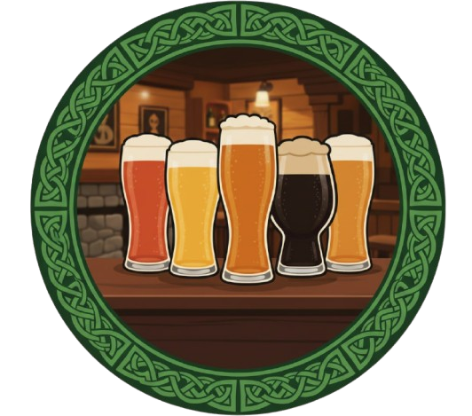
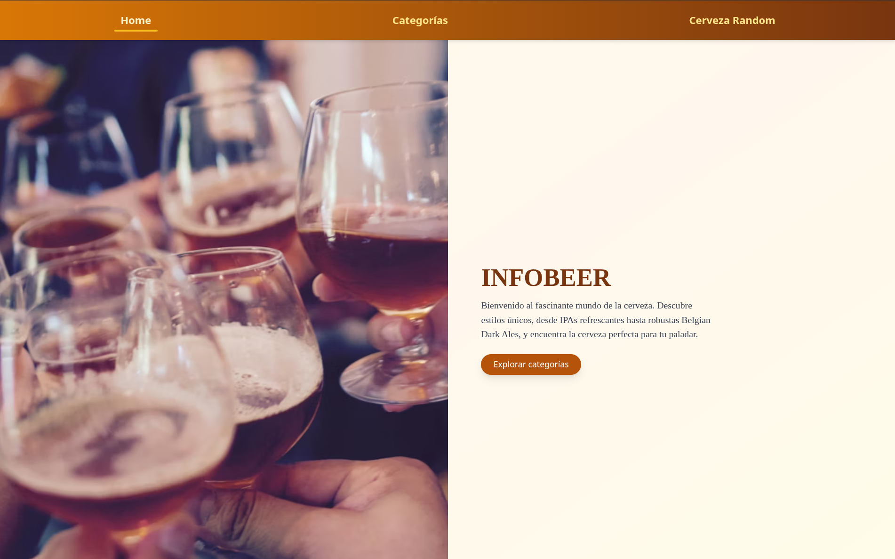
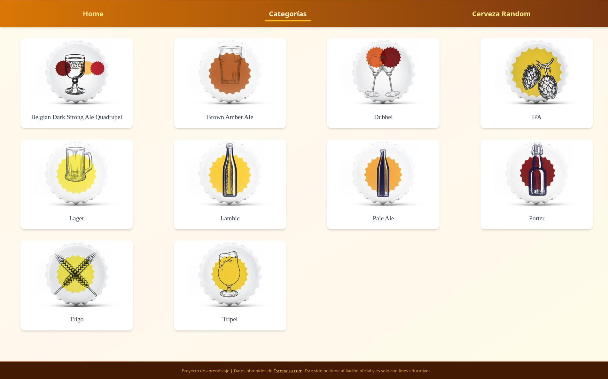
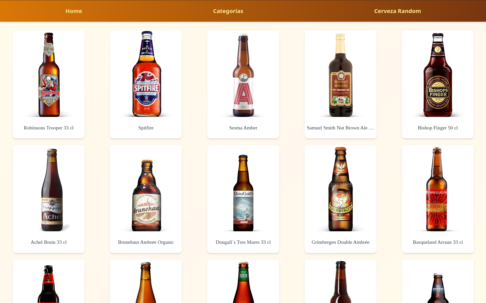
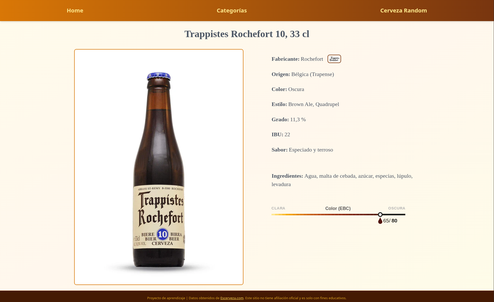

<div align="center">
<h1>InfoBeer - Beer Explorer</h1>
  

### 🌍 Choose Language

[**English**](README.md) • [**Español**](README.es.md)

</div>

---

# 🚀 Description

InfoBeer is a web application designed for beer lovers that allows exploring and discovering different beer styles and varieties.

### ✨ Main Features:

- 📂 **Style Navigation** - Explore beer categories
- 🍺 **Complete Catalog** - Discover many beers within each style
- 🔍 **Detailed View** - Complete information for each beer
- 🎨 **Modern Interface** - Responsive and intuitive design

---

### 🎯 Objective

The goal of **InfoBeer** is to develop a **fullstack dockerized web application** that allows users to explore and discover different beer styles and varieties.  
This project combines a **React/TypeScript frontend**, **Node.js/Express backend**, and **PostgreSQL database**, all managed via **Docker Compose** for easy installation and deployment.

### 📦 Data Sources

The beer data in the database **is not original**, it was obtained from [escerveza.com](https://escerveza.com/) via **web scraping** in another personal project.  
You can check the scraper repository here: [🍻 scraping-beers-escervezas](https://github.com/Jorge-Guedes/scraping-beers-escervezas).

---

## 🖼️ Preview

<div align="center">

### Home / Main Screen


<br>
<em>Home / InfoBeer main page</em>

### Beer Categories


<br>
<em>Explore beers by style</em>

### Beer List


<br>
<em>Complete catalog within a style</em>

### Beer Details


<br>
<em>Detailed information of a beer</em>

</div>

---

# 💻 Tech Stack

### **Frontend:**

<div>    </div>

### **Backend:**

<div>  </div>

### **Database:**

<div> </div>

### **DevOps:**

<div>  </div>

---

# 🚀 Quick Start

## 📋 Requirements

- **Docker**: Version 20.10 or higher
- **Docker Compose**: Version 2.0 or higher

### ✅ Check installation:

```bash
docker --version
docker compose version

```

## 1 - 📥 Clone the repository

```bash
git clone https://github.com/tu-usuario/infobeer.git
cd infobeer
```

## 2 - 🐳 Run the application

```bash
docker compose up --build
```

## 3 - 🌐 Access the application

Once all containers are running:

- 🖥️ **Web Application**: http://localhost

## 4 - ⏹️ Stop the application

```bash
docker compose down
```

---

# 🔧 Development Mode

### 📋 Additional Requirements

- **Node.js** version 20 or higher
- **PostgreSQL** version 15 or higher

### ✅ Check installation:

```bash
node --version
npm --version
```

## 🗄️ 1 - Database Setup

You have two options to set up the database:

### 🅰️ Option A: Using Docker Compose (Recommended)

- Navigate to the database folder  
  cd backend/BBDD
- Run PostgreSQL using Docker  
  docker compose up -d
- Manually create the **beers_db** database
- Load the **beers_db.sql** file using pgAdmin, DBeaver, or another tool

### 🅱️ Option B: Local PostgreSQL

- Install PostgreSQL if you don't have it
- Create the database named **beers_db**
- Load the file backend/BBDD/beers_db.sql using your preferred SQL client

## 🚀 2 - Backend Setup

### 📁 Navigate to the backend directory

```bash
cd backend
```

### 📦 Install dependencies

```bash
npm install
```

### ⚙️ Configure environment variables

Create a **.env** file in the _backend_ folder with:

```txt
DB_HOST=localhost
DB_PORT=5432
DB_NAME=beers_db
DB_USER=tu_usuario
DB_PASSWORD=tu_contraseña
PORT=3000
```

### 🖥️ Run backend

```bash
npm run dev
```

## 🌐 3 - Frontend Setup

### 📁 Navigate to the frontend directory

```bash
cd frontend
```

### 📦 Install dependencies

```bash
npm install
```

### 🎯 Run the frontend

```bash
npm run dev
```

## ✅ 4 - Verify Everything Works

- **Backend:** Available at http://localhost:3000
- **Frontend:** Available at http://localhost:5173 (or similar port)
<div align="center">
  
  <br>
  <em>Cheers! 🍻</em>
</div>
